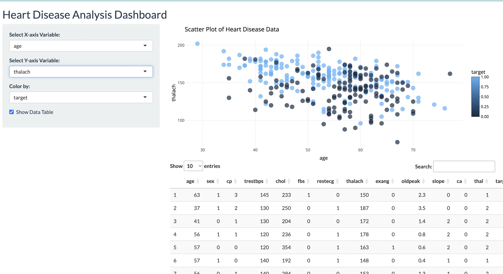
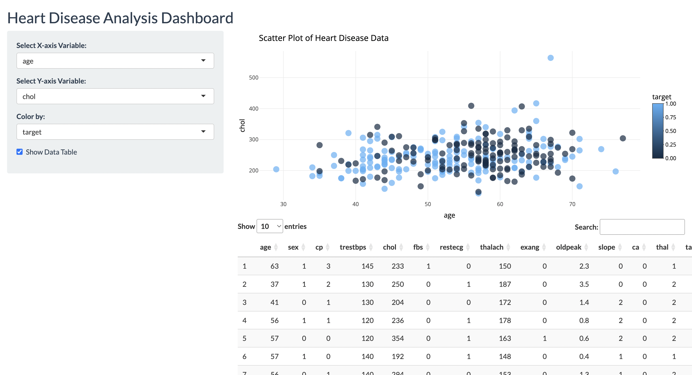

# Heart Disease Prediction Shiny App

## Project Overview
The **Heart Disease Prediction Shiny App** is a web-based application built using the **Shiny** framework in **R**. This interactive tool is designed to predict the likelihood of heart disease in individuals based on a variety of health metrics, such as age, blood pressure, cholesterol levels, and other key indicators. The application provides an easy-to-use interface where users can input their personal health data, and in return, it generates a prediction of their risk for heart disease.

The app leverages machine learning algorithms to analyze the data and provide valuable insights into heart disease risk factors. The goal of this project is to assist individuals in understanding their health conditions and to provide healthcare professionals with a simple, yet effective tool for early heart disease risk detection.

## Key Features:
- **Interactive Prediction**: Users can input their personal health data (such as age, cholesterol levels, blood pressure) into the app to receive an immediate prediction of their likelihood of having heart disease.
- **Data Visualization**: The app offers interactive charts and graphs, helping users to visualize patterns in the dataset and understand how various health factors contribute to heart disease risk.
- **Machine Learning Model**: The app uses a machine learning model trained on a real-world dataset to make predictions. The model was developed using the **caret** package and is capable of providing accurate risk assessments based on the input data.
- **User-Friendly Interface**: The Shiny app is designed with a clean, easy-to-navigate interface, ensuring a smooth user experience for individuals of all technical backgrounds.

## Technologies Used:
- **R Programming**: R is the main programming language used to develop the Shiny app and perform data analysis.
- **Shiny**: A web application framework for R that allows for the creation of interactive web apps with minimal effort.
- **caret**: A comprehensive machine learning package used for model building and evaluation.
- **ggplot2**: A data visualization library used to create static and interactive plots.
- **tidyverse**: A collection of R packages designed for data science tasks such as data cleaning, transformation, and visualization.

## Dataset:
This application uses the **UCI Heart Disease dataset**, which includes a wide range of health features related to heart disease. The dataset contains information on various patient attributes, such as:
- **Age**: The age of the patient.
- **Sex**: The gender of the patient (Male = 1, Female = 0).
- **Chest Pain Type**: Type of chest pain experienced by the patient.
- **Resting Blood Pressure**: Resting blood pressure in mmHg.
- **Serum Cholestoral**: Cholesterol level in mg/dl.
- **Fasting Blood Sugar**: Whether fasting blood sugar is greater than 120 mg/dl (1 = true; 0 = false).
- **Resting Electrocardiographic Results**: Results of the patient’s electrocardiogram.
- **Maximum Heart Rate Achieved**: Maximum heart rate achieved during exercise.
- **Exercise Induced Angina**: Whether the patient experiences angina during exercise (1 = yes; 0 = no).
- **Oldpeak**: Depression induced by exercise relative to rest.
- **Slope**: The slope of the peak exercise ST segment.
- **Major Vessels Colored by Fluoroscopy**: Number of major vessels colored by fluoroscopy.
- **Thalassemia**: Presence of thalassemia.

This data is processed and used to train the machine learning model that predicts the likelihood of heart disease based on the input features.

# Heart Disease Prediction App

## Project Overview

The **Heart Disease Prediction Shiny App** is a web-based application built using the **Shiny** framework in **R**. This interactive tool is designed to predict the likelihood of heart disease in individuals based on a variety of health metrics, such as age, blood pressure, cholesterol levels, and other key indicators. The application provides an easy-to-use interface where users can input their personal health data, and in return, it generates a prediction of their risk for heart disease.

The app leverages machine learning algorithms to analyze the data and provide valuable insights into heart disease risk factors. The goal of this project is to assist individuals in understanding their health conditions and to provide healthcare professionals with a simple, yet effective tool for early heart disease risk detection.

---

## Key Features

- **Interactive Prediction**: Users can input their personal health data (such as age, cholesterol levels, blood pressure) into the app to receive an immediate prediction of their likelihood of having heart disease.
- **Data Visualization**: The app offers interactive charts and graphs, helping users to visualize patterns in the dataset and understand how various health factors contribute to heart disease risk.
- **Machine Learning Model**: The app uses a machine learning model trained on a real-world dataset to make predictions. The model was developed using the **caret** package and is capable of providing accurate risk assessments based on the input data.
- **User-Friendly Interface**: The Shiny app is designed with a clean, easy-to-navigate interface, ensuring a smooth user experience for individuals of all technical backgrounds.

---

## Install Dependencies

In your R environment, install the necessary packages using the following command:

```r
install.packages(c("shiny", "caret", "ggplot2", "tidyverse"))
```

## Run the App

After setting up the environment, follow these steps to launch the app:

1. Navigate to the project folder.
2. Run the following command:

```r
library(shiny)
runApp("app.R")
```


## Enter Patient Data

- Input the patient's health data into the app.
- Key fields include:
  - **Age**
  - **Cholesterol Levels**
  - **Blood Pressure**
  - **Other Health Indicators**

---

## View Predictions and Insights

- After inputting the data, click **Predict** to receive the likelihood of heart disease.
- Explore the interactive visualizations to understand the relationships between different health metrics and heart disease risk.

---

## App Results

Below is a sample screenshot of the app’s prediction result and data visualization:

```html


```

---

## Contribution

Contributions to this project are welcome! If you'd like to contribute:

1. Fork the repository.
2. Make your changes.
3. Create a pull request.

Feel free to suggest improvements, add new features, or report bugs.

---

## License

This project is licensed under the **MIT License**. See the [`LICENSE.md`](LICENSE.md) file for more information.

---

## Acknowledgments

- **Dataset Source**: UCI Heart Disease dataset.
- **Machine Learning Libraries**: The `caret` package was used to build and evaluate the machine learning model.
- **Visualization Libraries**: The app uses `ggplot2` for data visualization and `Shiny` for building the interactive web interface.

